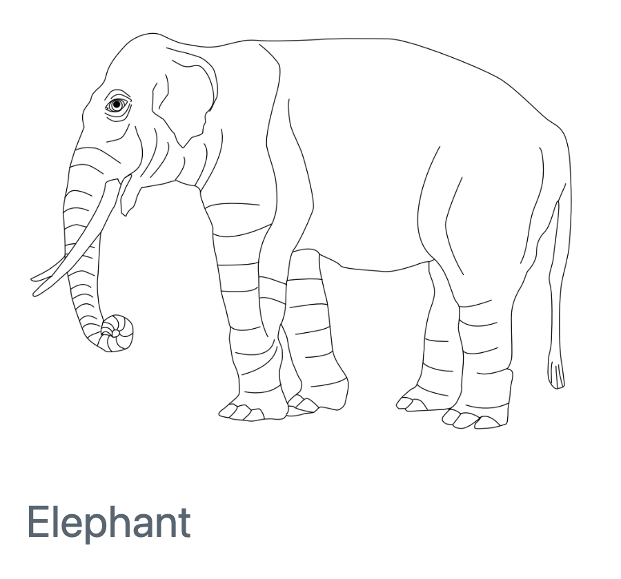

### Research Area One

{fig-alt="A drawing of an elephant. A placeholder for a cool figure related to your project. Alt text should describe the figure you use in enough detail for someone to understand it without seeing it." width=40%}

Description of Research Area

### Presentations and Code

[Talk Name](https://github.com) (Date, Event name or location)

[Repository Name](https://github.com) (Code purpose)

### Publications and Manuscripts

**Your name**, Author (YYYY). [title](https://doi.org). *Journal.*

**Your name**, Author (Preprint). [title](https://arxiv.org/). 

## Research Area Two

{fig-alt="A drawing of an elephant. A placeholder for a cool figure related to your project. Alt text should describe the figure you use in enough detail for someone to understand it without seeing it." width=40%}

Description of Research Area

### Presentations and Code

[Talk Name](https://github.com) (Date, Event name or location)

[Repository Name](https://github.com) (Code purpose)

### Publications and Manuscripts

**Your name**, Author (YYYY). [title](https://doi.org). *Journal.*

**Your name**, Author (Preprint). [title](https://arxiv.org/).
